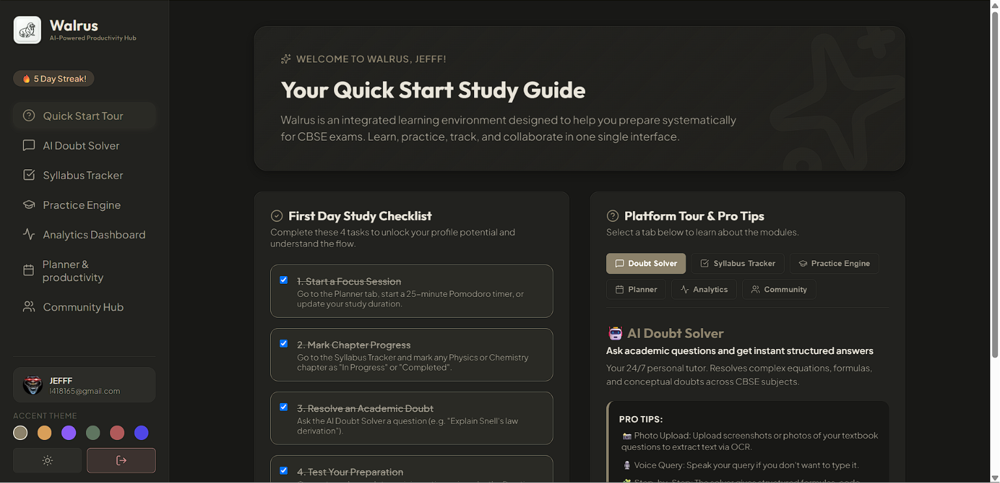
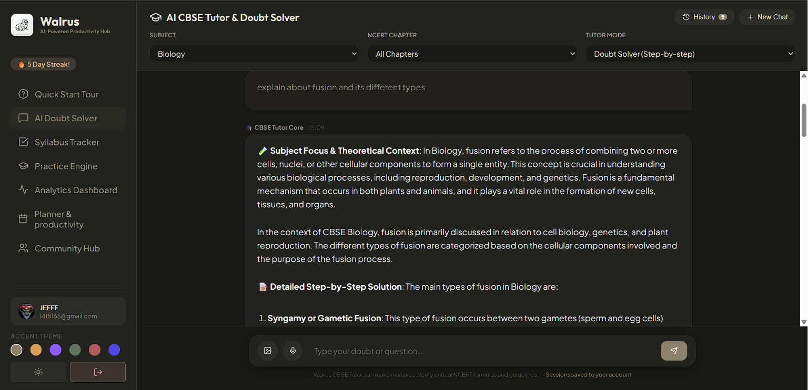
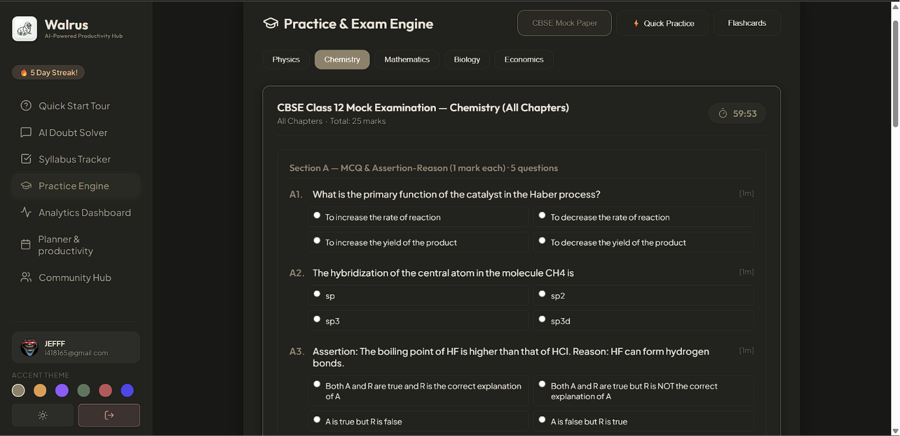
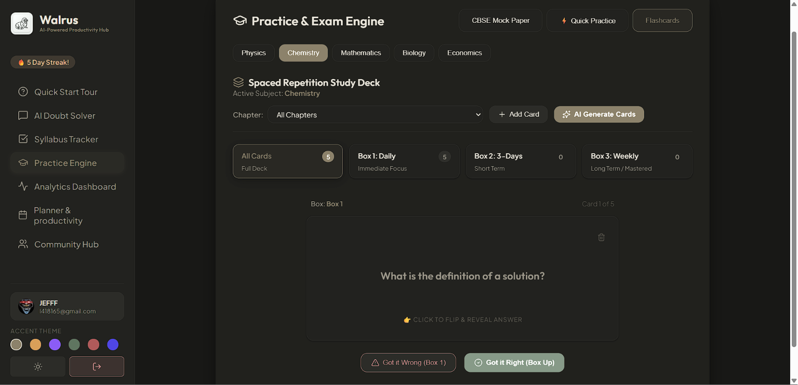

<div align="center">


<sub>🚧 currently implemented only for 12th 🚧</sub>

<br/>

[](https://react.dev)
[](https://vitejs.dev)
[](https://nodejs.org)
[](https://www.mongodb.com)
[](https://redis.io)
[](https://ai.google.dev)

<br/>


**A full-stack, AI-driven study platform built exclusively for CBSE Class 11 & 12 students.**
Ask doubts, take mock exams, review flashcards, track your syllabus, and collaborate with peers — all in one place.

<br/>

<a href="#-features">✨ Features</a> •
<a href="#-tech-stack">🛠 Tech Stack</a> •
<a href="#-getting-started">🚀 Getting Started</a> •
<a href="#-project-structure">📁 Structure</a> •
<a href="#-environment-variables">🔑 Env Vars</a> •
<a href="#-contributing">🤝 Contributing</a>

</div>

<br/>


## 📸 Sneak Peek

<div align="center">
<table>
<tr>
<td width="50%" align="center"><i>Dashboard</i><br/></td>
<td width="50%" align="center"><i>AI Doubt Solver</i><br/></td>
</tr>
<tr>
<td width="50%" align="center"><i>Mock Test Simulator</i><br/></td>
<td width="50%" align="center"><i>Flashcards</i><br/></td>
</tr>
</table>

</div>


## ✨ Features

<details open>
<summary><b>🤖 AI Doubt Solver</b></summary>
<br/>

- Chat with a **CBSE-specialized AI tutor** powered by Google Gemini (upgraded to `gemini-2.5-flash`)
- Understands subject context (Physics, Chemistry, Maths, Biology, Economics)
- Beautifully rendered **LaTeX equations** and **Markdown** responses
- Caches responses in **Redis** (Upstash in cloud, custom RedVER engine locally) for instant `<3ms` hits
- Maintains session history and **persists active chat states** across browser refreshes and tab switches
</details>

<details>
<summary><b>📝 CBSE Mock Test Engine & Simulator</b></summary>
<br/>

Generate **full-length board-pattern papers** on demand with a smart duration-based marking system:

| Duration | Marks | Paper Type |
|:--------:|:-----:|:-----------|
| 30 min   | 15    | MCQ Sprint |
| 60 min   | 25    | Unit Test  |
| 120 min  | 50    | Half Paper |
| 180 min  | 80    | Full Board Simulation |

- All 5 CBSE section types — **MCQ, VSA, SA, Long Answer, Case Study**
- 🔒 **Strict Exam Mode (Desktop)**: Runs exam in fullscreen. Switching tabs, minimizing the window, or exiting fullscreen triggers a warning — 3 warnings auto-submits the paper
- ⏱ Live countdown timer with auto-submit
- 🎯 **AI-powered evaluation & scoring** with per-question feedback
- 📉 **Error Analysis Report** — identifies weak topics and generates a targeted study plan
- 🔍 **Detailed Attempt Review** — interactive panel reviewing past attempts with color-coded MCQs and model solutions
- 📄 **Markdown Downloads** — export attempted mock exams as clean `.md` documents
</details>

<details>
<summary><b>⚡ Quick Practice / PYQ Drill</b></summary>
<br/>

- Pick chapters, question type, and count
- Instant CBSE-quality question sets with reveal-on-demand model answers
- Supports MCQ, Very Short, Short, and Long Answer formats
</details>

<details>
<summary><b>🃏 Spaced Repetition Flashcards</b></summary>
<br/>

- **Leitner Box system** (Box 1 → 2 → 3) for scientifically optimized review
- AI-generates flashcards for any chapter with one click
- Manual card creation with Markdown/LaTeX support
- Persisted to MongoDB with offline localStorage fallback
- Filter by **Subject**, **Chapter**, and **Leitner Box**
</details>

<details>
<summary><b>📊 Syllabus Tracker & Analytics</b></summary>
<br/>

- Mark chapters as **Not Started / In Progress / Completed**
- Visual heatmap of your subject-wise coverage
- Score history across all mock tests
- Analytics dashboard with performance trends
</details>

<details>
<summary><b>👥 Community Hub</b></summary>
<br/>

- **Doubt Forum** — post and answer questions, upvote the best solutions
- **Share Notes** — upload CBSE notes with images, links, and descriptions
  - Click any image to open a **full-screen lightbox viewer**
  - One-click **download** of any shared image
- **Virtual Study Room** — synchronized Pomodoro timer + peer chat
</details>

<details>
<summary><b>📅 Planner & Productivity</b></summary>
<br/>

- **AI Syllabus Calendar Builder** — automatically generates custom weekly study schedules based on exam dates and completed chapters
- **Persistent Study Schedule** — caches schedules in browser storage until the target exam date passes, with validation checks and one-click regeneration
- Pomodoro timer integration
</details>

<details>
<summary><b>👤 Profile & Streaks</b></summary>
<br/>

- Daily study streak tracker 🔥
- Personalized dashboard with recent activity
</details>


## 🛠 Tech Stack

<div align="center">

</div>

<br/>

| Layer | Technology |
|:------|:-----------|
| **Frontend** | React 19, Vite 8, Vanilla CSS |
| **Backend** | Node.js, Express.js |
| **Database** | MongoDB Atlas (Mongoose ODM) |
| **Cache** | Redis (Upstash Cloud / RedVER Local) |
| **AI** | Google Gemini API (gemini-2.5-flash) |
| **Auth** | JWT + bcryptjs |
| **OCR** | Tesseract.js |
| **Icons** | Lucide React |


## 🚀 Getting Started

### Prerequisites
- Node.js ≥ 18
- A [MongoDB Atlas](https://www.mongodb.com/cloud/atlas) cluster
- A Redis Cache server (Upstash Cloud or local RedVER engine)
- A [Google Gemini API key](https://ai.google.dev)

### 1️⃣ Clone the repository
```bash
git clone https://github.com/hashirR786/walrus-study.git
cd walrus-study
```

### 2️⃣ Install frontend dependencies
```bash
npm install
```

### 3️⃣ Install backend dependencies
```bash
cd server
npm install
cd ..
```

### 4️⃣ Configure environment variables
Create a `.env` file in the **root** of the project:
```env
MONGODB_URI=your_mongodb_atlas_connection_string
GEMINI_API_KEY=your_google_gemini_api_key
JWT_SECRET=your_super_secret_jwt_key
PORT=5000
REDIS_URL=redis://127.0.0.1:6379
```

### 5️⃣ Run the app

Open **two terminals**:

**Terminal 1 — Backend**
```bash
cd server
npm run dev
```

**Terminal 2 — Frontend**
```bash
npm run dev
```

<div align="center">

🎉 **The app will be live at [http://localhost:5173](http://localhost:5173)** 🎉

</div>


## 📁 Project Structure

```
walrus-study/
├── src/
│   ├── components/
│   │   ├── Auth.jsx              # Login & Signup
│   │   ├── Sidebar.jsx           # Navigation sidebar
│   │   ├── DoubtSolver.jsx       # AI Tutor chat
│   │   ├── PracticeEngine.jsx    # Mock tests, Quick Practice, Flashcards
│   │   ├── SyllabusTracker.jsx   # Chapter progress tracker
│   │   ├── Analytics.jsx         # Performance dashboard
│   │   ├── Community.jsx         # Forum, Notes, Study Room
│   │   ├── Planner.jsx           # Study planner
│   │   ├── ProfileView.jsx       # User profile & streaks
│   │   └── MarkdownRenderer.jsx  # LaTeX + Markdown renderer
│   ├── index.css                 # Global design system
│   ├── App.jsx                   # Root component & routing
│   └── config.js                 # API base URL config
│
└── server/
    ├── models/                   # Mongoose schemas
    │   ├── User.js
    │   ├── UserProgress.js
    │   ├── ChatSession.js
    │   ├── DoubtForum.js
    │   ├── Flashcard.js
    │   ├── MockTest.js
    │   ├── SharedNote.js
    │   └── StudyRoomMessage.js
    ├── routes/
    │   ├── ai.js                 # Gemini AI endpoints
    │   ├── auth.js               # Auth endpoints
    │   └── student.js            # Student data endpoints
    ├── controllers/
    ├── middleware/
    └── index.js                  # Express server entry point
```


## 🔑 Environment Variables

| Variable | Description | Required |
|:---------|:-------------|:--------:|
| `MONGODB_URI` | MongoDB Atlas connection string | ✅ |
| `GEMINI_API_KEY` | Google Gemini API key | ✅ |
| `JWT_SECRET` | Secret key for JWT signing | ✅ |
| `REDIS_URL` | Redis connection URL (`redis://` or `rediss://`) | ✅ |
| `PORT` | Backend server port (default: 5000) | ❌ |


## 🎨 Design System

Walrus uses a hand-crafted design system with:

- 🏖 **Warm Sand / 🌙 Dark Slate** dual theme
- CSS custom properties for full theme switching
- 6 accent color options (selectable per user)
- Glassmorphism cards, smooth micro-animations
- Fully responsive layout


## 🗺 Roadmap

- [ ] Real-time study room via WebSockets
- [ ] PDF export for mock test papers
- [ ] Push notifications for spaced repetition reminders
- [ ] Mobile app (React Native)
- [ ] Teacher/parent dashboard


## 🤝 Contributing

Contributions are welcome! Feel free to:

1. Fork the repository
2. Create a feature branch (`git checkout -b feature/your-feature`)
3. Commit your changes (`git commit -m 'feat: add your feature'`)
4. Push to the branch (`git push origin feature/your-feature`)
5. Open a Pull Request

<div align="center">


</div>


## 📈 Star History

<div align="center">

</div>

## 📄 License

This project is licensed under the **MIT License**.

<br/>


<div align="center">

Made with ❤️ for students everywhere

**[⬆ Back to top](#-walrus)**

</div>
