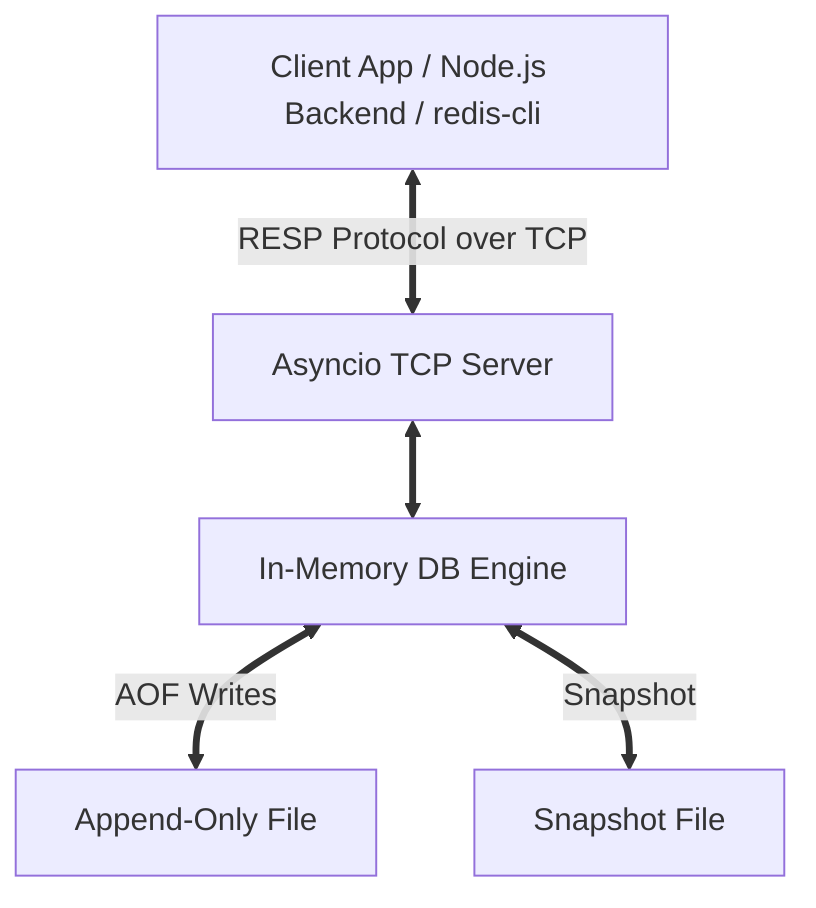

# RedVER: A Standalone Redis-Compatible Cache Engine from Scratch

RedVER is an educational, production-ready, in-memory key-value database built entirely from scratch in Python. It implements the standard **Redis Serialization Protocol (RESP v2)**, allowing it to serve as a direct drop-in replacement for standard Redis in your local and cloud backend stacks.

Built using **zero third-party dependencies**—leveraging only Python's standard library (`asyncio`, `socket`, `json`, etc.)—RedVER is designed for developers who want to study database internals, custom network protocol parsers, and event-driven architectures.

> [!NOTE]
> **Walrus App Integration**: While RedVER serves as the default cache server for **local development and testing** of the Walrus Study App, the cloud-hosted production deployment of Walrus connects to a serverless **Upstash Redis** database. This architecture is necessary due to Render Free Tier restrictions, which do not allow incoming private network traffic on Free Web Services. Because RedVER is fully Redis-compatible, this transition requires zero backend code changes!

---

## ✨ Features

- **RESP-Compliant Protocol**: Supports parsing and encoding of standard Redis Serialization Protocol (RESP v2) data structures.
- **Concurrent TCP Server**: Built using Python's asynchronous event loop (`asyncio`) to handle multiple client connections non-blockingly.
- **Built-in HTTP Dashboard UI**: Self-contained HTTP socket server serving a rich visual monitoring dashboard with live stats, keyspace browser, and an interactive Web CLI console.
- **Dual Durability Modes**:
  - **Append-Only File (AOF)**: Sequentially logs write operations to disk for recovery on startup.
  - **Snapshotting (RDB)**: Dumps the database memory block atomically to a JSON database file (`SAVE` command).
- **TTL Key Expiration**: Supports key lifespans using both **Passive Eviction** (purging on read) and **Active Eviction** (background scanning loop).
- **Interactive CLI Client**: Comes with a colorful terminal shell for direct database interactions.

---

## 🏗 System Architecture



1. **Protocol Parser (`src/protocol.py`)**: A recursive-descent parser that processes RESP symbols: Simple Strings (`+`), Errors (`-`), Integers (`:`), Bulk Strings (`$`), and Arrays (`*`). It also supports inline telnet/netcat commands as a fallback.
2. **Storage Engine (`src/storage.py`)**: Manages the in-memory keyspace hashmap and handles internal operation mappings. Includes a standard connection handshake `HELLO` command to support modern Redis clients (like `node-redis` or `redis-py`).
3. **Persistence Layer (`src/persistence.py`)**: Coordinates disk writes. On start, it checks for `appendonly.aof` or `dump.rdb` to recover the database state automatically.

---

## ⚙️ Supported Commands

| Command | Syntax | Description |
|:---|:---|:---|
| **`PING`** | `PING [message]` | Echoes back a ping status or optional message. |
| **`SET`** | `SET key value [EX seconds]` | Stores a string with an optional expiration time. |
| **`GET`** | `GET key` | Returns the value. Active-evicts if the key has expired. |
| **`INCR`** | `INCR key` | Increments the integer value of a key. |
| **`DEL`** | `DEL key1 [key2 ...]` | Removes one or more keys. |
| **`EXISTS`**| `EXISTS key1 [key2 ...]` | Returns the count of existing keys. |
| **`EXPIRE`**| `EXPIRE key seconds` | Sets a TTL on a key. |
| **`TTL`** | `TTL key` | Returns the remaining TTL in seconds. |
| **`KEYS`** | `KEYS [pattern]` | Searches keys matching standard glob patterns (e.g. `*`). |
| **`FLUSHDB`**| `FLUSHDB` | Wipes the keyspace completely. |
| **`SAVE`** | `SAVE` | Writes an atomic database state snapshot to disk. |
| **`QUIT`** | `QUIT` | Gracefully closes the client connection. |

---

## 🚀 Getting Started

### Prerequisites
- Python 3.9 or newer. No external libraries are needed!

### 1. Run the Database Server
To start the database server (this exposes the RESP port `6379` and HTTP Dashboard on port `8080` concurrently):
```bash
python -m src.server
```

**Available Flags:**
- `--host`: Bind address (default: `127.0.0.1`).
- `--port`: Listen port for TCP/RESP clients (default: `6379`).
- `--http-port`: Port for HTTP Web Dashboard (default: `8080`).
- `--no-aof`: Disable active Append-Only File logging.

### 2. View the Web Dashboard
Open your browser and navigate to:
```
http://127.0.0.1:8080/
```
The dashboard provides a visual interface showing live uptime, operation speeds, keyspace listings, durability size, and an embedded shell client for interactive execution.

### 3. Connect via the Terminal Client
Launch the custom interactive shell to run database queries:
```bash
python -m src.client
```

### 4. Run the Test Suite
RedVER includes a complete suite of unit and integration tests:
```bash
python -m unittest tests/test_redis.py
```

---

## 🔌 Connecting with Redis Clients (Examples)

Because RedVER conforms to standard RESP protocols, standard Redis libraries can interact with it directly.

### Node.js Example (`redis` library)
```javascript
import { createClient } from 'redis';

const client = createClient({
  url: 'redis://127.0.0.1:6379'
});

client.on('error', err => console.error('Redis Client Error:', err));

await client.connect();

// Perform operations
await client.set('myKey', 'Hello from RedVER!', { EX: 60 });
console.log(await client.get('myKey')); // 'Hello from RedVER!'

await client.disconnect();
```

### Python Example (`redis-py`)
```python
import redis

client = redis.Redis(host='127.0.0.1', port=6379, decode_responses=True)

client.set('user:session', 'active', ex=300)
print(client.get('user:session')) # 'active'
```
