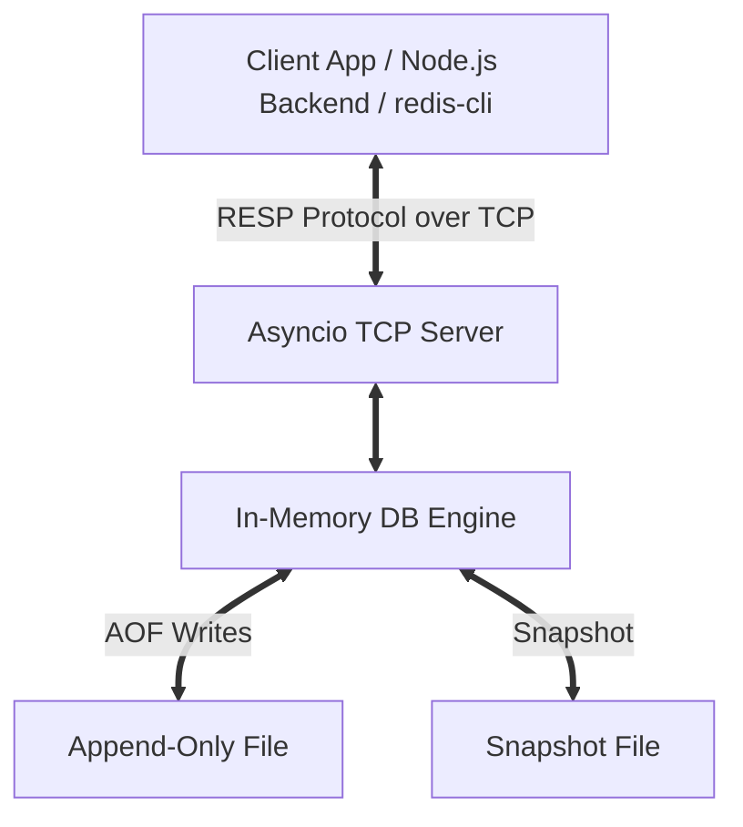

# RedVER: Redis-Compatible Cache Engine

A custom, lightweight, in-memory key-value database built in Python. RedVER is fully compatible with the standard **Redis Serialization Protocol (RESP)**, making it a drop-in cache replacement for backend systems.

---

## 🎯 Target Use Cases in Walrus Study App

RedVER was designed to optimize the performance, cost, and scalability of the **Walrus Study App**:

1. **AI Tutor Responses Cache**:
   - Stores large generated Markdown responses from Google Gemini.
   - Prevents redundant, slow, and expensive AI API calls for identical or highly repetitive user doubts.
2. **Strict Exam Mode State Tracker**:
   - Offers microsecond write/read performance to track active student sessions and tab-switch warning counts.
   - Leverages **TTL (Time To Live) expiration** to automatically discard session state if the mock exam runs out of time or is abandoned.

---

## 🏗 System Architecture



### 1. RESP Protocol Parser (`src/protocol.py`)
Implements RESP v2 serialization and deserialization.
- **Parser**: Hand-rolled recursive descent parser supporting Simple Strings (`+`), Errors (`-`), Integers (`:`), Bulk Strings (`$`), and Arrays (`*`).
- **Encoder**: Converts Python objects (strings, lists, dicts, integers, exceptions) into RESP byte sequences.
- **Fallback**: Automatically detects raw text streams (e.g. from `telnet` or `netcat`) and parses them as inline commands.

### 2. Storage Engine & Expiration (`src/storage.py`)
- Core keyspace is maintained inside memory buffers for instant access.
- Supports **Passive Eviction**: expired keys are intercepted and deleted during read operations (`GET`, `EXISTS`).
- Supports **Active Eviction**: a background task periodically scans random keys with an expiration, purging expired ones to keep memory footprints minimal.

### 3. Durability Layer (`src/persistence.py`)
Dual-mode persistence ensures crash-safety:
- **Append-Only File (AOF)**: Modifying operations (e.g., `SET`, `DEL`, `EXPIRE`) are logged sequentially to `appendonly.aof` in raw RESP format. Replayed step-by-step on server boot.
- **Snapshotting (RDB)**: The current database structure is dumped atomically to `dump.rdb` in structured JSON on call of the `SAVE` command.

---

## ⚙️ Supported Commands

| Command | Arguments | Description |
|:---|:---|:---|
| **`PING`** | `[message]` | Returns `PONG` or the optional message. |
| **`SET`** | `key value [EX seconds]` | Stores the key-value pair with optional TTL expiration. |
| **`GET`** | `key` | Retrieves the value of the key (returns `nil` if expired/non-existent). |
| **`DEL`** | `key1 [key2 ...]` | Deletes one or more keys. Returns number of keys deleted. |
| **`EXISTS`** | `key1 [key2 ...]` | Checks existence. Returns count of existing keys. |
| **`EXPIRE`** | `key seconds` | Sets an expiration time in seconds on a key. |
| **`TTL`** | `key` | Returns remaining TTL in seconds (-2 if expired/not found, -1 if no TTL). |
| **`KEYS`** | `[pattern]` | Returns all keys matching standard glob patterns (e.g., `*`). |
| **`FLUSHDB`** | — | Clears all database records. |
| **`SAVE`** | — | Writes database state atomically to disk snapshot. |
| **`QUIT`** | — | Closes the connection. |

---

## 🚀 Getting Started

### Prerequisites
- Python ≥ 3.9 (No external dependencies required!)

### 1. Run the Server
Start the server (this hosts the standard RESP port `6379` and the HTTP Dashboard on `8080` concurrently):
```bash
python -m src.server
```
Options:
- `--host`: Bind address (default: `127.0.0.1`).
- `--port`: Listen port for standard Redis clients (default: `6379`).
- `--http-port`: Port to host the Web Dashboard (default: `8080`).
- `--no-aof`: Disable Append-Only File persistence.

### 2. Open the Web Dashboard
Open your browser and navigate to:
```
http://127.0.0.1:8080/
```
The self-hosted dashboard allows you to view metric widgets (uptime, ops count), monitor keys, see dynamic visual TTL progress bars, and run command strings inside an interactive terminal console.

### 3. Run the Interactive CLI Client
Launch the customized, colorful terminal shell:
```bash
python -m src.client
```

### 3. Run Automated Tests
Execute the unit and integration test suite:
```bash
python -m unittest tests/test_redis.py
```

---

## 🔗 Integration with Walrus Node.js Backend

Because RedVER is fully compliant with the standard Redis protocol, you can use any existing Redis library in Node.js (like `redis` or `ioredis`) to connect directly to it.

```javascript
const { createClient } = require('redis');

// Connect to RedVER on default port
const cache = createClient({
    url: 'redis://127.0.0.1:6379'
});

cache.on('error', (err) => console.log('RedVER Cache Error:', err));

async function run() {
    await cache.connect();
    
    // 1. Cache an AI Tutor response for 1 hour
    const doubtKey = 'doubt:physics:kinematics:123';
    const aiResponse = 'To find velocity, take the derivative of position...';
    await cache.set(doubtKey, aiResponse, {
        EX: 3600 // Expire in 1 hour
    });
    
    // 2. Fetch the cached response
    const cachedVal = await cache.get(doubtKey);
    console.log('Cached AI Response:', cachedVal);
}

run();
```
